# Week 4 -- KNIME Data Wrangling Workflow

## Overview

This KNIME workflow performs basic data wrangling and exploratory
analysis on the **June 2026 New Zealand Airbnb listings dataset** from
[Inside Airbnb](https://insideairbnb.com/get-the-data/).

The workflow loads the dataset, cleans selected fields, separates
**Christchurch City** listings from the full New Zealand dataset, and
produces visualisations for:

-   Price distribution for all New Zealand listings
-   Price distribution for Christchurch City listings
-   Price distributions for New Zealand and Christchurch together
-   Distribution of the time since the last review
-   The most-reviewed listings, focusing on the top 10%

------------------------------------------------------------------------

## KNIME Workflow

The workflow follows the structure below:

``` text
CSV Reader
    |
String Manipulation
    |
Column Filter
    |
Row Filter ────────────────> Christchurch City
    |                              |
    |                              +--> Histogram: Christchurch price distribution
    |                              |
    |                              +--> Sorter
    |                                   |
    |                                   +--> Row Sampler (top 10%)
    |                                         |
    |                                         +--> Histogram: top 10% most-reviewed listings
    |
    +--> Histogram: New Zealand price distribution
    |
    +--> Concatenate <--- Christchurch City
          |
          +--> Histogram: combined price distributions
    |
    +--> Constant Value Column Appender
          |
          +--> String to Date&Time
                |
                +--> Date&Time Difference
                      |
                      +--> Histogram: days since last review
```

------------------------------------------------------------------------

## 1. CSV Reader

**Purpose:** Load the June 2026 New Zealand Airbnb `listings.csv`
dataset into KNIME.

The CSV Reader is the starting point of the workflow. It imports the raw
Airbnb listings data so that the remaining KNIME nodes can clean, filter
and analyse the dataset.

**Input:** `listings.csv`

**Output:** Raw New Zealand Airbnb listings table.

<table>
  <tr>
    <td align="center">
      <strong>Raw New Zealand Airbnb listings table</strong><br>
      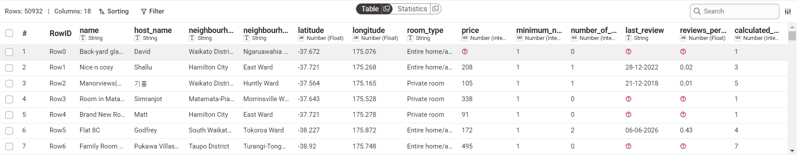
    </td>
  </tr>
</table>

------------------------------------------------------------------------

## 2. String Manipulation

**Purpose:** Clean unwanted characters from the `name` field.

The String Manipulation node is used to remove unwanted characters from
listing names. This makes the text cleaner and easier to work with
later.

**Output:** A cleaned `name` field.

<table>
  <tr>
    <td align="center">
      <strong>A cleaned `name` field.</strong><br>
      
    </td>
  </tr>
</table>

------------------------------------------------------------------------

## 3. Column Filter

**Purpose:** Remove columns that are not required for the analysis.

The Column Filter removes unwanted or unnecessary columns from the
dataset. Keeping only relevant fields makes the workflow easier to
manage and reduces the amount of data passed to later nodes.

**Output:** This filter removes `License` column. 

<table>
  <tr>
    <td align="center">
      <strong>License Columns Removed</strong><br>
      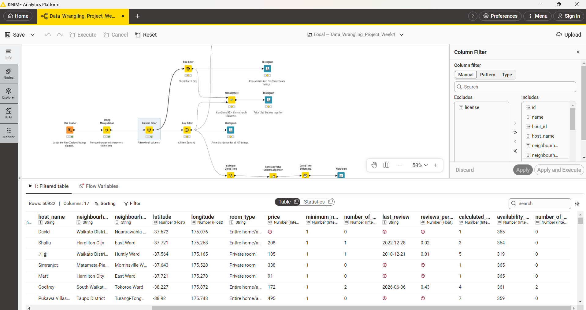
    </td>
  </tr>
</table>

------------------------------------------------------------------------

## 4. Christchurch City Analysis

**Purpose:** Create a subset containing only Airbnb listings in Christchurch City and show the distribution of Airbnb prices within Christchurch.

The **Row Filter** separates Christchurch City listings from the full New Zealand dataset. The filtered Christchurch dataset is then connected to a **Histogram** node using the `price` field to visualise the price distribution.

**Output:** Christchurch City Filter and Christchurch Price Distribution.

<table>
  <tr>
    <td align="center">
      <strong>Christchurch City Filter</strong><br>
      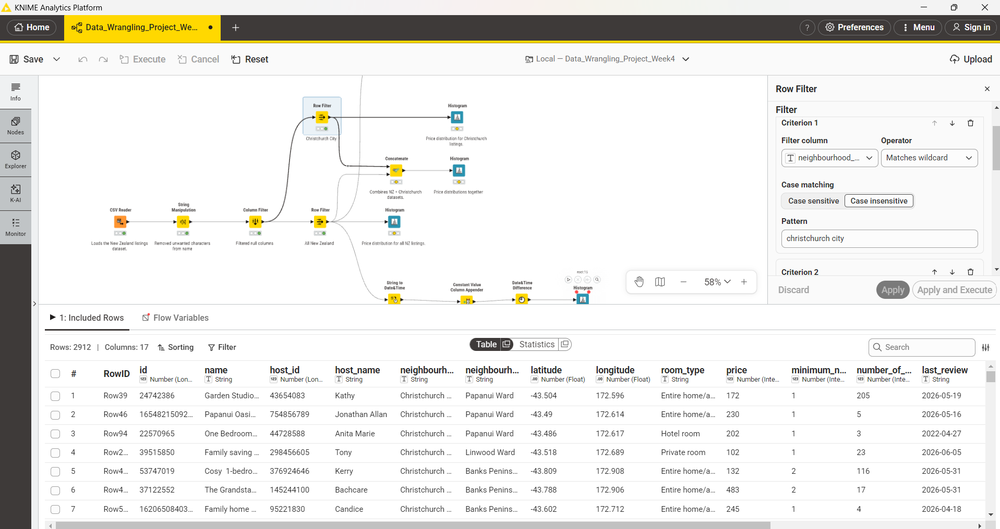
    </td>
    <td align="center">
      <strong>Christchurch Price Distribution</strong><br>
      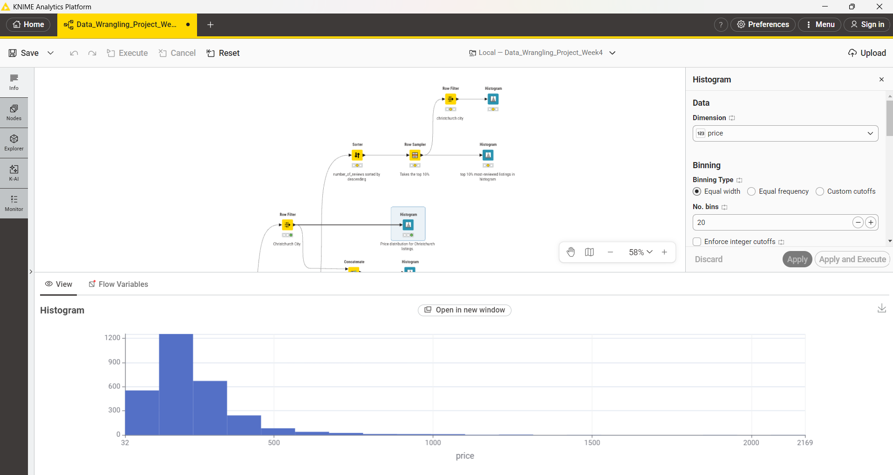
    </td>
  </tr>
</table>

------------------------------------------------------------------------

# New Zealand Price Analysis

## 5. Histogram -- New Zealand Price Distribution

**Purpose:** Show the distribution of Airbnb prices across all New
Zealand listings.

The full New Zealand dataset is connected directly to a Histogram node
using the `price` field.

**Required output:** Price distribution for all New Zealand listings.

<table>
  <tr>
    <td align="center">
      <strong>Price distribution for all New Zealand</strong><br>
      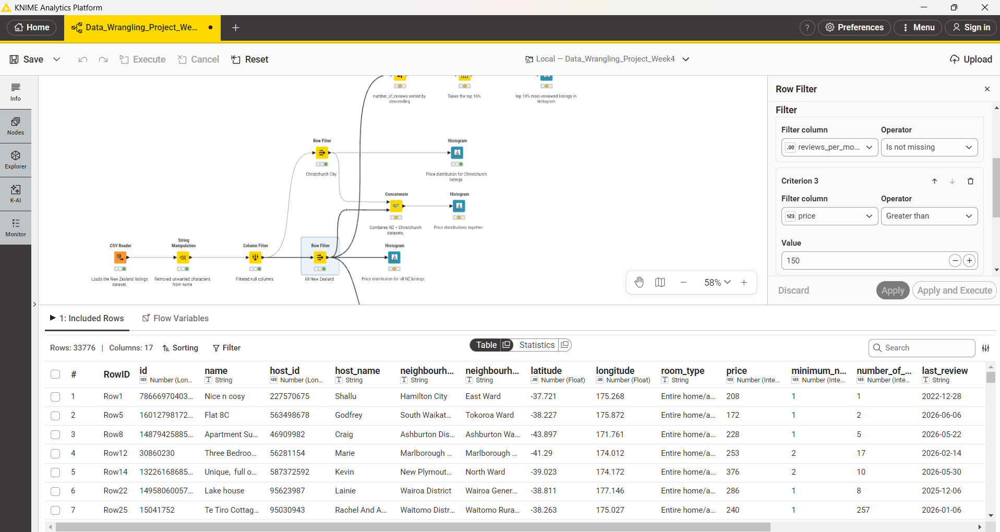
    </td>
     <td align="center">
      <strong>Price distribution for all New Zealand</strong><br>
      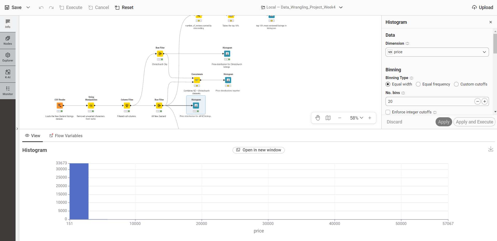
    </td>
  </tr>
</table>

------------------------------------------------------------------------

# Combined Price Analysis

## 6. Concatenate

**Purpose:** Combine the New Zealand and Christchurch data streams for a
combined comparison.

The Concatenate node receives data from the relevant New Zealand and
Christchurch branches and combines the rows into one table.

**Important:** Christchurch City listings are already part of the New
Zealand dataset. Therefore, if the full New Zealand dataset and the
Christchurch subset are concatenated, Christchurch listings will appear
twice in the resulting table. This should be considered when
interpreting the combined plot.

<table>
  <tr>
    <td align="center">
      <strong>Concatenate Node</strong><br>
      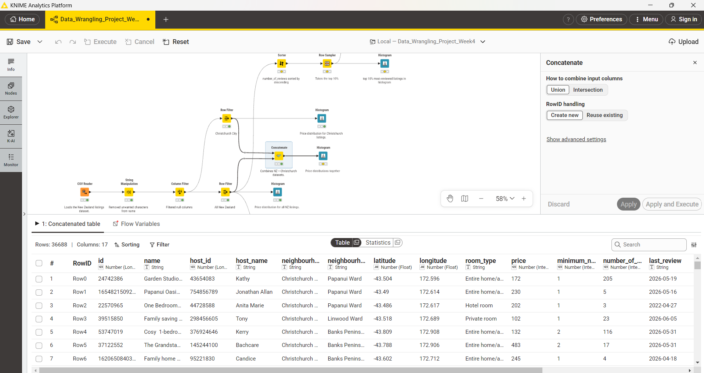
    </td>
    <td align="center">
      <strong>Combined Price Histogram</strong><br>
      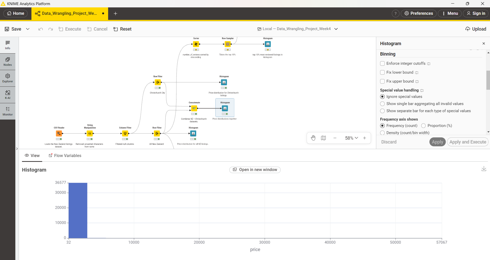
    </td>
  </tr>
</table>

------------------------------------------------------------------------

# Most-Reviewed Listings

## 7. Sorter

**Purpose:** Sort Airbnb listings according to the number of reviews.

The Sorter uses the `number_of_reviews` field and sorts it in
**descending order**.

This places the listings with the highest number of reviews at the top
of the table.

**Sort order:** `number_of_reviews` -- descending

<table>
  <tr>
    <td align="center">
      <strong>Sorting the `number_of_reviews` Column -- descending</strong><br>
      
    </td>
  </tr>
</table>

------------------------------------------------------------------------

## 8. Row Sampler -- Top 10%

**Purpose:** Select the top 10% most-reviewed listings.

The Row Sampler is configured to take **10% of the rows** after the data
has been sorted by `number_of_reviews` in descending order.

Because the rows are sorted first, the sampled rows represent the
listings with the highest review counts.

**Output:** Top 10% most-reviewed New Zealand Airbnb listings.

<table>
  <tr>
    <td align="center">
      <strong>Top 10% most-reviewed New Zealand Airbnb</strong><br>
      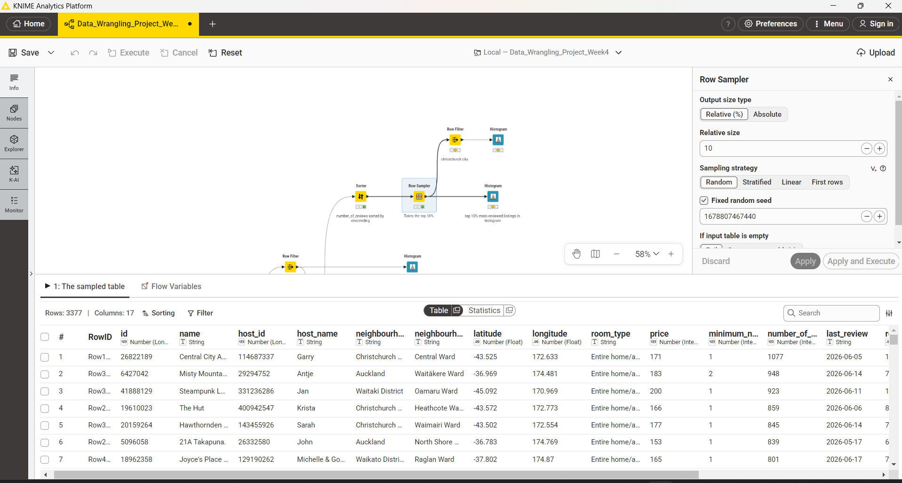
    </td>
  </tr>
</table>

------------------------------------------------------------------------

## 9. Histogram -- Top 10% Most-Reviewed Listings

**Purpose:** Visualise the selected top 10% of listings.

The top 10% subset is passed to a Histogram node. This allows the
distribution of a selected numeric field for the most-reviewed listings
to be explored.

The workflow should use the appropriate field required by the assignment
when presenting this result.

**Output:** Visualise the selected top 10% of all New Zealand listings.

<table>
  <tr>
    <td align="center">
      <strong>Top 10% Most-Reviewed Listings of all New Zealand</strong><br>
      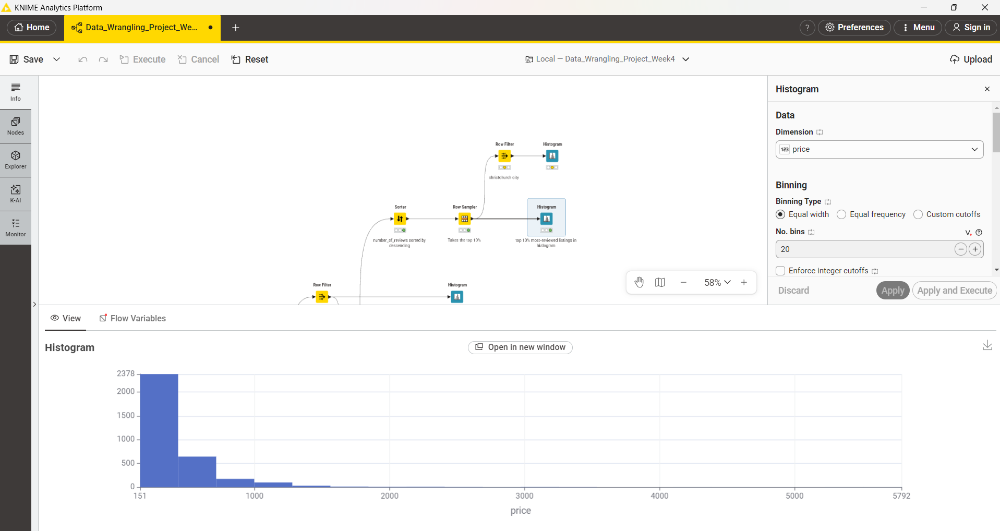
    </td>
  </tr>
</table>

------------------------------------------------------------------------

## 10. Finding How Many Top-10% Listings Are in Christchurch

The workflow shown above identifies the **top 10% most-reviewed
listings**, but an additional step is needed to directly calculate how
many of those listings are located in Christchurch City.

After the Row Sampler, add a **Row Filter** for Christchurch City.

**Output:** Top-10% Listings in Christchurch.

<table>
  <tr>
    <td align="center">
      <strong>Top-10% Listings in Christchurch.</strong><br>
      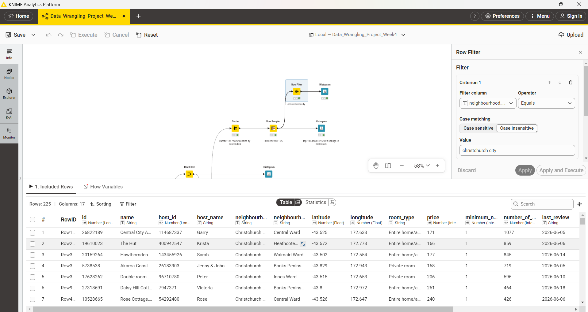
    </td>
    <td align="center">
      <strong>Histogram: Top-10% Listings in Christchurch.</strong><br>
      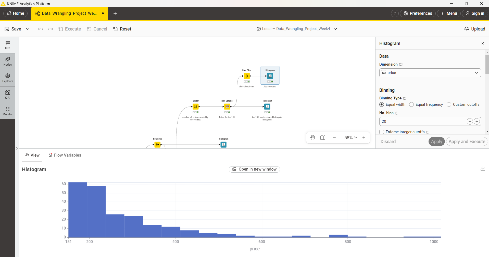
    </td>
  </tr>
</table>

------------------------------------------------------------------------

# Days Since Last Review

## 11. Add and Convert the Review Dates

**Purpose:** Prepare the date fields required to calculate how long ago each listing was last reviewed.

The **Constant Value Column Appender** adds the scrape/publish date to every row. The **String to Date&Time** node then converts the `last_review` field from a string into a KNIME Date&Time value. For the June 2026 dataset, the `last_review` values use the `yyyy-MM-dd` format.

**Output:** A new scrape/publish date column is added, and the `last_review` field is converted to a Date&Time format.

<table>
  <tr>
    <td align="center">
      <strong>String to Date&Time and Constant Value Column Appender</strong><br>
      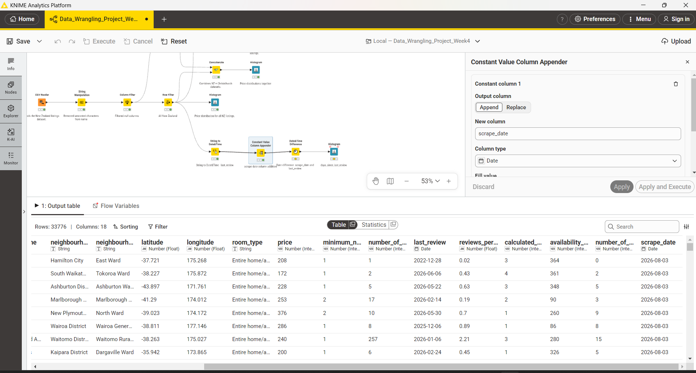
    </td>
  </tr>
</table>

------------------------------------------------------------------------

## 12. Days Since Last Review Calculation and Distribution

**Purpose:** Calculate how many days have elapsed between the scrape/publish date and each listing's last review, and visualize the distribution across the dataset.

The **Date&Time Difference** node calculates the time elapsed between the two dates:

```text
Scrape/Publish Date - Last Review Date
        =
Days Since Last Review

```

The output connects directly to a Histogram node to plot the distribution of this new numeric feature across all Airbnb listings.

**Output:** A new numeric feature days_since_last_review and a histogram visualizing its distribution across the dataset.

<table>
  <tr>
    <td align="center">
      <strong>Date&Time Difference Table</strong><br>
      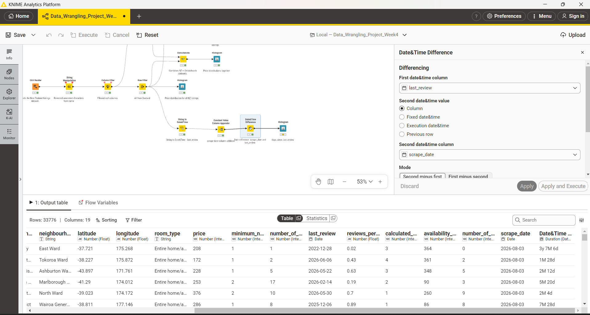
    </td>
    <td align="center">
      <strong>Days Since Last Review Histogram</strong><br>
      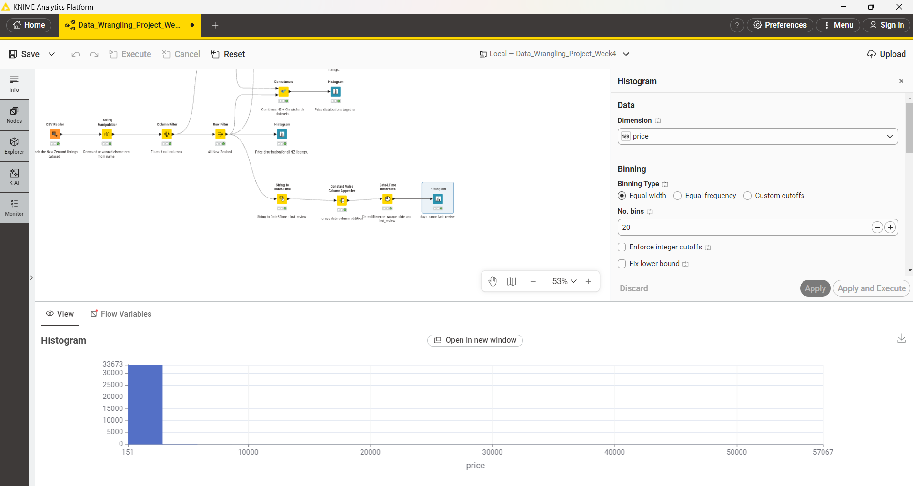
    </td>
  </tr>
</table>
